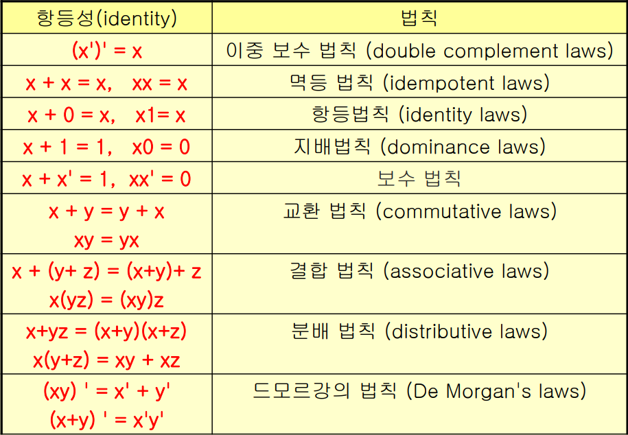

### 명제
- 참(True)이나 거짓(False)으로 진리를 구분할 수 있는 문장
- 여러 개의 명제를 조합할 수 있습니다

### 논리 연산자
1. NOT(부정) : 명제의 참과 거짓을 반전
2. AND(논리곱) : 모두 참이라면 참
3. OR(논리합) : 적어도 1개 이상이 참이라면 참
4. Exclusive or(배타적 논리합) : 둘 중 하나만 참일 경우 참
5. Implication(함축, 조건) : p(T) -> q(F) 일때만 거짓
6. Biconditional(상호조건) : 두 명제가 일치할 때만 참

### 역, 이, 대우
명제 : p -> q  
역 : q -> p  
이 : ~p -> ~q  
대우 : ~q -> ~p

### 동치
- 논리적으로 일치한다

