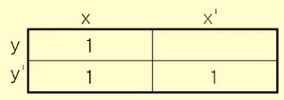

### 부울 대수
정의 : 집합 S={0, 1}에 대해 다음의 세 가지 연산이 존재한다.
- 보수 (complement)
    - '로 표시
    - 원소 0에 대하여 0' = 1, 원소 1에 대하여 1' = 0
- 부울 합 (boolean sum)
- 부울 곱 (boolean product)

연산 우선순위 : 보수 >> 곱 >> 합

부울 함수는 부울 변수와 부울 연산자로 구성된 부울 식으로 표현할 수 있다.

### 부울 대수 법칙

### 카르노 맵 (Karnaugh Map)
부울 함수의 간단한 논리합 형식을 찾아내는 방법
1. 두 변수 x, y를 갖는 부울식을 위한 카르노 맵은 사각형에서 2x2개의 칸으로 구성된다. 각 칸은 부울 함수의 최소항을 의미한다.

2. 부울 함수에서 해당 최소항이 있으면 1로 표시한다.

