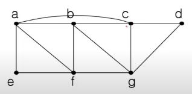

### 오일러 그래프
오일러 경로(Eulerian path) : 그래프 G의 모든 연결선을 한 번만 방문하는 경로 
오일러 순환(Eulerian cycle or circuit) : 시작점과 끝점이 동일한 오일러 경로 
오일러 그래프 : 오일러 순환이 존재하는 그래프

차수(degree) : 정점 u에 접합된 연결선의 수, deg(u)로 표기

<정리> 오일러 경로를 갖기 위한 필요충분 조건 
2개 이상의 정점을 갖는 루프가 없는 연결 그래프에서 홀수 차수를 갖는 정점이 하나도 없거나 오직 두 개(시작점, 끝점)만 존재해야 한다. 
특히 모든 정점이 짝수 차수를 가지면 오일러 순환이 존재하며, 이 그래프는 오일러 그래프이다.

### 해밀턴 그래프
해밀턴 경로(Hamitonian path) : 그래프 G에서 모든 정점을 정확히 한 번만 지나는 경로 
해밀턴 순환(Hamitonian cycle or circuit) : 시작점과 끝점이 같은 해밀턴 경로

해밀턴 순환 알고리즘
- Exhaustive Search
- 탐색해야 되는 경로의 수
    - 트리의 leaf의 수
- 트리의 높이 : n + 1
- leaf의 수 : 2^n

해밀턴 순환 찾는 알고리즘 복잡도
- 알고리즘 복잡도 : O(x^n)
- 복잡도 함수는 다항식이 아니라 지수식이다
- 몹시 어려운 문제
- 유사한 복잡도 문제 : 암호해독, 바둑(장기, 체스 등), bin packing 등등