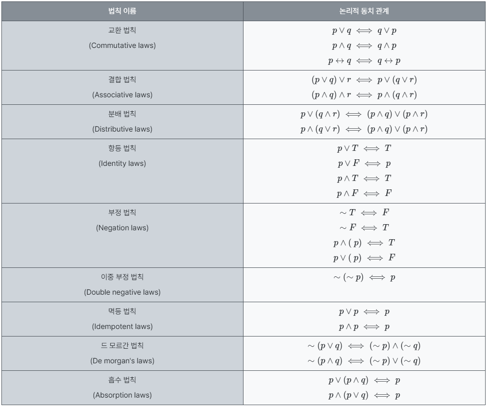

## 이산수학 (2주)
|파트|진행상태|학습시간|강의내용|비고|
|:---:|:---:|:---:|:---:|:---:|
|1|O|2|이산수학 기초||
|1||5|명제, 추론, 귀납, 부울대수||
|2||3|알고리즘, 그래프||
|2||2|형식언어와 오토마타, 셈||
|2||3|관계, 부분순서||

이산수학: 셈(순열과 조합)- 곱의 법칙과 합의 법칙

이산수학: 부울대수와 논리 회로 설계(3)- 부울식의 최소화: 카르노 맵

이산수학: 형식언어와 오토마타5 - 스트링 매칭 알고리즘

이산수학: 형식언어와 오토마타4 - 오토마타와 언어

이산수학: 형식언어와 오토마타3- 유한상태기계(finite state machine)

이산수학: 형식언어와 오토마타2 - 정규식과 정규문법

이산수학: 형식언어와 오토마타1- 형식언어와 문법

이산수학 그래프6: 최단경로 알고리즘(2)

이산수학 그래프5: 최단경로 알고리즘(1)

이산수학 그래프4: 최소신장 트리(minimum spanning tree)

이산수학 그래프3: 그래프 채색(coloring)

이산수학 그래프2: 기본 용어

이산수학 그래프1: 오일러 순환과 해밀턴 순환

이산수학: 알고리즘(1)

이산수학: 부울대수와 논리회로 설계(2)- 수정

이산수학: 부울대수와 논리회로 설계(1)

이산수학: 연역법과 귀납법, 수학적 귀납법

이산수학 명제1-2: 명제의 논리적 표현

이산수학 강의, 명제1-1

이산수학 명제 : 문제풀이 1

이산수학 : 명제 문제 풀이 2

이산수학 : 추론, 연역과 귀납 : 문제 풀이

이산수학 수학적귀납법: 문제풀이

이산수학 부울대수 : 문제풀이1

이산 수학 : 부울대수 문제풀이 2

이산수학 : 부울식 최소화 문제 풀이

이산수학 : 관계1 - 관계의 정의와 개념

이산수학 : 관계2 - 관계의 표현과 합성

이산수학 : 관계 - 관계의 유형

이산수학 : 관계 - 관계 개념, 표현, 합성 문제 풀이

이산수학 : 관계의 유형 - 문제 풀이

이산수학 : 관계의 닫힘

이산수학 : 동치 관계

이산수학 : 관계의 닫힘과 동치 관계 문제 풀이

이산 수학 : 부분 순서 관계 (1)

이산 수학 : 부분 순서 관계 (2) - 격자(lattice)와 위상 정렬

## 목차
1. [이산수학 기초](https://github.com/suhyun0927/CS_study/blob/main/%EC%9D%B4%EC%82%B0%EC%88%98%ED%95%99/1.%EA%B8%B0%EC%B4%88.md)

## 추가 교재 및 참고자료

#### 영상
 
이산수학 (11.5H)
https://www.youtube.com/playlist?list=PLW8wOTYOluvFr4favjXEVXMghqQNYOOqI

#### 교재
컴퓨팅 사고력을 키우는 이산수학
https://product.kyobobook.co.kr/detail/S000001743588

#### 블로그
https://brunch.co.kr/@toughrogrammer/8